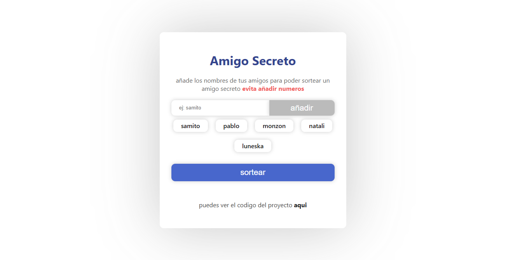
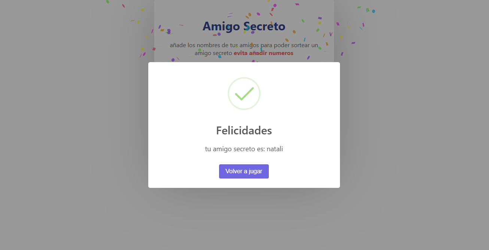

# Amigo Secreto

Este proyecto es una aplicación web para realizar un sorteo de "Amigo Secreto". Permite agregar nombres a una lista y luego sortear un nombre al azar.

## Características

- Agregar nombres a una lista.
- Validación para evitar nombres con números.
- Botón para sortear un nombre al azar.
- Mostrar el resultado del sorteo.
- Efecto de confeti al mostrar el resultado.

## Tecnologías Utilizadas

- HTML
- CSS
- JavaScript

## Estructura del Proyecto

```
/amigo-secreto
│
├── index.html
├── styles.css
├── index.js
└── README.md
└── /assets
    └── /img
          └── amigo-secreto.png
          └── sorteo-amigo-secreto.png
```

## Cómo Usar

1. Clona este repositorio en tu máquina local.
2. Abre el archivo `index.html` en tu navegador web.
3. Ingresa un nombre en el campo de texto y haz clic en "añadir" para agregarlo a la lista.
4. Una vez que hayas agregado todos los nombres, haz clic en "sortear" para seleccionar un amigo secreto al azar.

## Capturas de Pantalla

### Pantalla Principal



### Resultado del Sorteo



## Contribuciones

Las contribuciones son bienvenidas. Si deseas contribuir, por favor sigue los siguientes pasos:

1. Haz un fork del repositorio.
2. Crea una nueva rama (`git checkout -b feature/nueva-caracteristica`).
3. Realiza tus cambios y haz commit (`git commit -am 'Añadir nueva característica'`).
4. Haz push a la rama (`git push origin feature/nueva-caracteristica`).
5. Abre un Pull Request.

## Licencia

Este proyecto está bajo la Licencia MIT. Consulta el archivo [LICENSE](./LICENSE) para más detalles.
